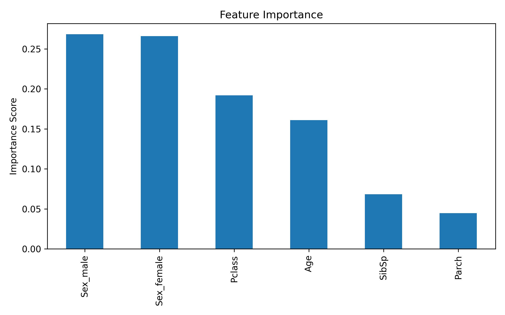

# 🚢 Titanic Survival Prediction (Kaggle)

## 📌 Project Overview

This project predicts whether a passenger survived the Titanic disaster
using machine learning.

The focus of this repository is to build the model **iteratively**,
documenting each experiment, measuring validation performance, and
improving the pipeline step by step.

------------------------------------------------------------------------

## 🗂 Project Structure

    titanic-ml/
    │
    ├── notebooks/
    │   └── eda.ipynb        # Exploratory data analysis and visualizations
    │
    ├── src/
    │   └── train.py         # Model training + validation + submission generation
    │
    ├── README.md
    └── .gitignore

------------------------------------------------------------------------

## 🧠 Problem Type

Binary Classification:

-   **1 → Survived**
-   **0 → Did Not Survive**

Dataset: Kaggle Titanic Competition

------------------------------------------------------------------------

# ✅ Implementation Progress

## ✔ Completed

-   Baseline RandomForest model
-   80/20 train--validation split (stratified)
-   Median imputation for `Age`
-   Mode imputation for `Embarked`
-   One-hot encoding for categorical variables
-   Validation accuracy tracking
-   Separation of EDA (notebook) and training script (src/)

------------------------------------------------------------------------

# 📊 Experiments & Results

## Experiment 1 --- Baseline Model

**Features:** `Pclass`, `Sex`, `SibSp`, `Parch`\
**Validation Accuracy:** \~0.821

## Experiment 2 --- Add Age

Added median-imputed `Age` feature.\
**Validation Accuracy:** \~0.832

## Experiment 3 --- Add Embarked

Added mode-imputed `Embarked` feature.\
**Validation Accuracy:** \~0.838

------------------------------------------------------------------------

# 📌 Current Model Snapshot

Model: `RandomForestClassifier`\
- `n_estimators = 100`\
- `max_depth = 5`\
- `random_state = 1`

**Current Validation Accuracy: 0.838**

------------------------------------------------------------------------

## 📊 Feature Importance



# 🔍 Key Findings from EDA

-   Survival rate is significantly higher for females (\~74%) than males
    (\~19%).
-   Passenger class strongly correlates with survival.
-   Age shows moderate signal (children more likely to survive).
-   Socioeconomic indicators (Pclass, Fare) appear important.

------------------------------------------------------------------------

# 🚀 How to Run

1.  Download the Titanic dataset from Kaggle.
2.  Place `train.csv` and `test.csv` in the project root.
3.  Run:

``` bash
python src/train.py
```

